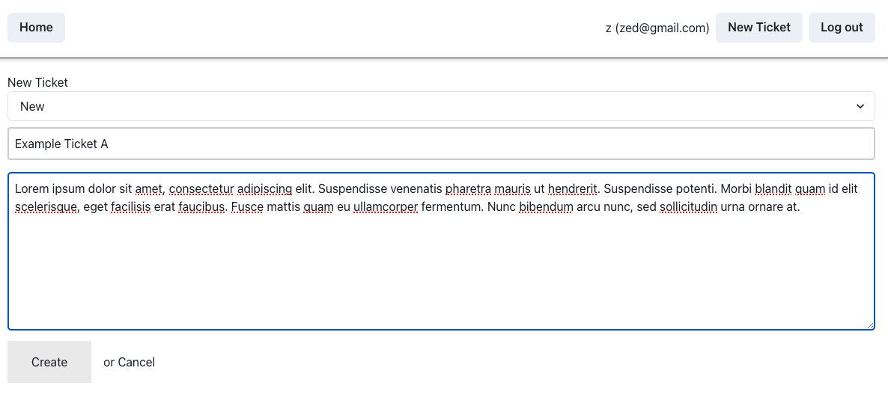
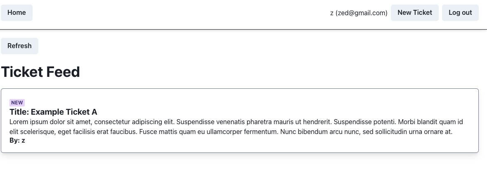
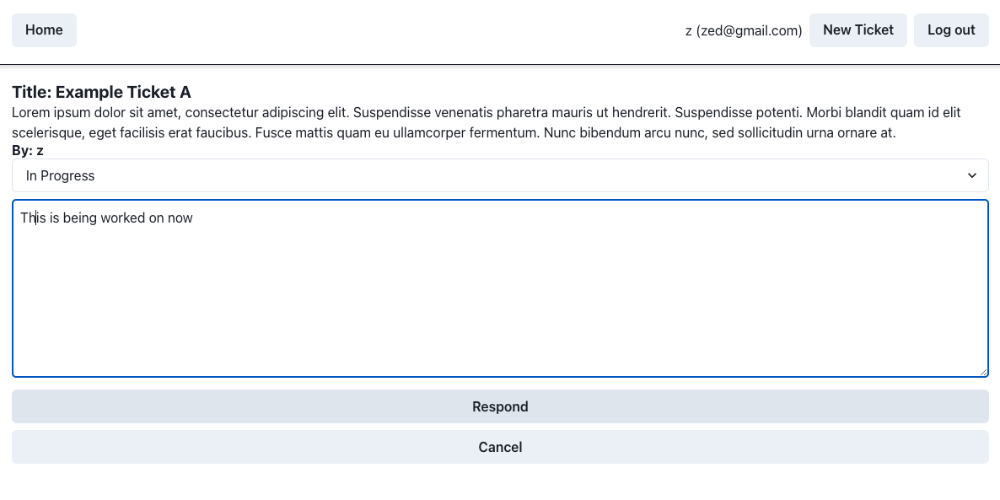
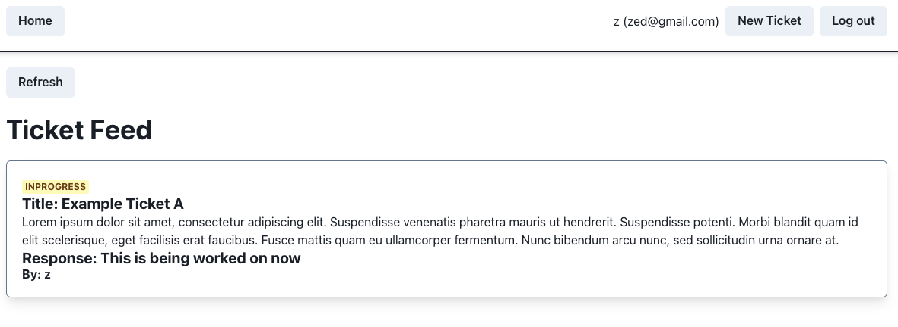

# Utilizing NextJS | Prisma | NextAuth | Credentials | ChakraUI | Postgres

## Introduction

NextJS app using:

- [Prisma](https://www.prisma.io/)
- [Chakra-UI](https://chakra-ui.com/)
- [NextAuthJS](https://next-auth.js.org/)
  - [Credentials (Email & Password)](https://next-auth.js.org/providers/credentials)
- [ChakraUI](https://chakra-ui.com/)
- [Vercel Postgres](https://vercel.com/docs/storage/vercel-postgres)

Note that the app uses a mix of server-side rendering with `getServerSideProps` (SSR) and static site generation with `getStaticProps` (SSG). When possible, SSG is used to make database queries already at build-time (e.g. when fetching the [Ticket feed](./src/pages/index.tsx)).

## DB Configuration

Push DB schemas

```
nvm use 18
```

```
npx prisma db push
```


## Install & run

node version

```
nvm use 18
```

install

```
git clone https://github.com/JFParra/ticket-management.git
yarn install
```

copy environment and fill in with your data

```
cp .env
```

run

```
yarn dev
```

build / prisma generate

```
yarn build
```

## Requirements
```
On the main page of the app, end users of the service should be able to submit support ticket
requests. Necessary fields include name, email and a description of the problem they are
experiencing.

On a separate page, the backend admin panel, support staff should be able to see a list
summary of each ticket, including status. They should be able to drill down into the ticket and
respond to a request, as well as update the status of the ticket. Possible statuses are “new”, “in
progress”, and “resolved”.

It is preferred that the front-end UI is implemented using React, with the backend implemented
in a language/framework of your choosing.

Please deploy your completed exercise to the web somewhere (using Vercel or similar) and
include the demo URL when submitting your solution.
Note: For sake of time, the app does not need to send email. Please output via logging instead,
“Would normally send email here with body: ...”
```

- end users of the service should be able to submit support ticket
requests (name, email and a description)



- On a separate page, the backend admin panel, support staff should be able to see a list
summary of each ticket, including status. 



- They should be able to drill down into the ticket and
respond to a request, as well as update the status of the ticket. Possible statuses are “new”, “inprogress”, and “resolved”.



- Note: For sake of time, the app does not need to send email. Please output via logging instead, “Would normally send email here with body: ...”




- Please deploy your completed exercise to the web somewhere (using Vercel or similar) and
include the demo URL when submitting your solution.

  Deployed - https://ticket-management-jfparra.vercel.app/
  Github - https://github.com/JFParra/ticket-management/tree/main